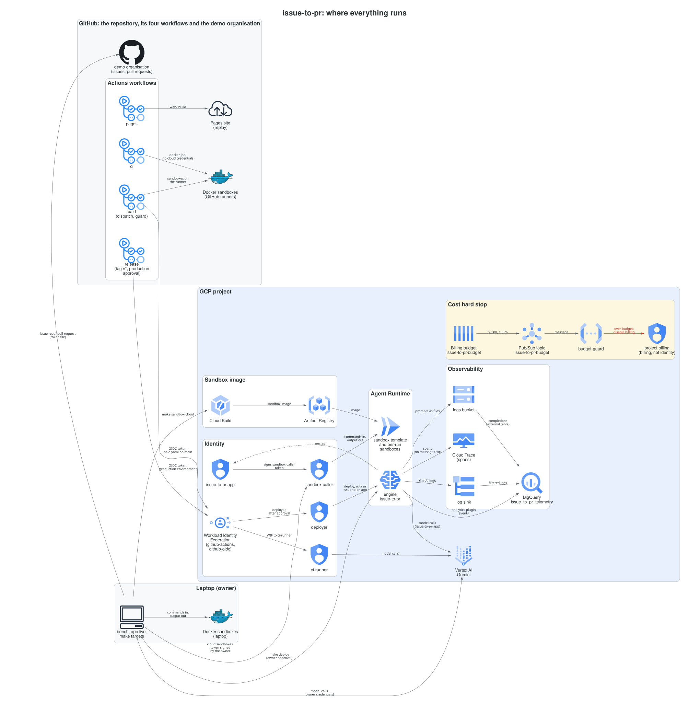

# issue-to-pr

A multi-agent pipeline on Google ADK 2.x that turns a GitHub issue into a tested, reviewed pull request.

[](https://github.com/omarcevi/sdlc-agent-pipeline/actions/workflows/ci.yaml)


**[Watch seven recorded runs](https://omarcevi.dev/sdlc-agent-pipeline/)**, step by step: the agent graph, every tool call, the diff, the tests, the review and the cost, failures included. A static site with no backend.

## How it works



A planner, a coder and a reviewer agent run in an ADK graph with deterministic function nodes between them: whether a patch exists and whether its tests pass come from the real `git diff` and real test exit codes, never from what a model claims. Every command the agents run, and every test, runs in a hermetic sandbox (Docker on a laptop or in CI, Agent Runtime in the cloud) that has no credentials and no network. A human reads the patch and types `approve` before any pull request opens.

More, with views of one run, CI/CD and identity, observability and cost, and the agent graph: [architecture](docs/architecture.md).

## What I measured

A hidden-test benchmark: 15 dev tasks (bugs, features, refactors and traps that should be declined) on three small Python repositories, three repeats each, Gemini 3.8 Flash. The three-agent pipeline ran against a single agent with the same tools, sandbox, guardrails, test-fix loop and per-run caps ($1.00 and 75 tool calls). Hidden tests that the agents never see decide whether an issue is resolved.

| System | Resolved | Cost per run | Cost per resolved | Median time |
|---|---|---|---|---|
| Single agent | 36 of 45 | $0.38 | $0.47 | 171 s |
| Three agents (planner, coder, reviewer) | 34 of 45 | $0.43 | $0.57 | 319 s |

The single agent matched the three-agent pipeline on this task set. Both failed the same three multi-file features, nine runs each, all at the $1.00 cost cap. The other two multi-agent failures were runs on easy tasks stopped by a provider stall, not by the agents.

What it teaches:

- **The reviewer never changed an outcome.** It approved all 28 patches it saw, on the first round, and all 28 pass the hidden tests ([review audit](docs/results/2026-10-01-2b-review-audit.md)). A reviewer earns its cost only on tasks where a first patch is sometimes wrong.
- **The extra agents cost more.** On the resolved tasks that need a patch, the three agents made 42 tool calls per run against 23, and cost $0.35 against $0.26.
- **The cap and the context size decided the hard tasks, not the architecture.** The multi-file feature runs reached about a million input tokens and then the $1.00 cap, with either design.
- **Fifteen tasks is a small sample.** One task is 6.7 points of resolve rate.

On Agent Runtime sandboxes the pipeline gave the same outcome as on Docker on all three tasks of a parity run (one run each), and all 12 reviewer probes were `ok` on both backends ([cloud parity](docs/results/2026-10-02-3a-cloud-parity.md)).

Full report, with every failed run and what was checked by hand: [15-task comparison](docs/results/2026-10-01-2b-comparison.md).

## Engineering highlights

- **Two sandbox backends, one interface.** Docker and Agent Runtime implement the same [`Environment`](app/environment/base.py), and one [contract suite](tests/integration/test_environment_contract.py) of 13 tests passes on both ([Week 3A run log](docs/results/2026-10-02-3a-run-log.md)).
- **Deterministic routing.** Function nodes take the diff and run the tests themselves; a model saying the tests pass routes nothing ([ADR 2](docs/adr/0002-deterministic-routing.md)).
- **A sealed held-out split.** Five more tasks were written sealed (by one agent, checked by another, never opened by the main session) and have never been run: the owner dropped the held-out run for now, and they are published as they are ([ADR 5](docs/adr/0005-hidden-test-benchmark.md)).
- **A $500 spend limit with a hard stop.** A project budget (24,000 TRY, about $489) notifies a Cloud Run function that disables billing at 100%; a dry run showed it is wired. Per-run caps on cost, tool calls and wall clock apply to both systems ([ADR 6](docs/adr/0006-runner-wide-budget.md)).
- **Keyless CI/CD with an approval gate.** Lint, unit and Docker tests on every pull request and push to `main` (about 3 minutes, $0); paid runs only by manual dispatch behind a guard; deploys on a `v*` tag after the owner approves; GitHub signs in to GCP through Workload Identity Federation, with no keys ([CI/CD view](docs/architecture.md)).
- **Traces without message content.** The deployed agent's spans keep token counts and references to the messages, not their text; checked on a 212-span trace ([Week 3A run log](docs/results/2026-10-02-3a-run-log.md)).
- **Code reviews that caught real bugs** ([Week 2A run log](docs/results/2026-09-30-week2a-run-log.md), [Week 3A run log](docs/results/2026-10-02-3a-run-log.md)):
  - the old scorer counted three patches that fixed nothing as resolved; the hidden tests now run in a second, fresh sandbox;
  - an empty model answer was recorded as a runner crash, and a crashed run as $0 spent; the first is now an agent failure, and a crash keeps its cost;
  - one failed `docker run` during scoring threw away a paid run; scoring now retries;
  - the Terraform output for the cloud engine was a bare id, not the full resource name that teardown needs.

## Run it yourself

You need Python 3.12, [uv](https://docs.astral.sh/uv/) and Docker. Anything that calls a model also needs a Google Cloud project with Vertex AI (or a Gemini API key), set in `.env` from [`.env.example`](.env.example). The benchmark runs in the sandbox image: build it once with `make sandbox-image`.

```bash
uv sync                                     # install
make test                                   # unit tests: no model, no cloud
uv run python -m bench.run --tasks tc-001   # one benchmark task (calls Gemini, spends credits)
uv run python -m app.live --repo OWNER/NAME --issue N --approver LOGIN [--base BRANCH] [--run-id ID] [--quiet]
```

The live run works on a real GitHub issue. It needs a terminal, `LIVE_REPOS`, `LIVE_ALLOWED_USERS` and a GitHub token in the file named by `GITHUB_TOKEN_FILE` (never in the environment). It shows you the patch, and only the word `approve` opens the pull request.

Everything else (evals, reviewer probes, the replay site, the cloud backend, deploys and teardown) is in [AGENTS.md](AGENTS.md).

## Project documents

- Decision records:
  - [ADR 1: Graph workflow over autonomous multi-agent chat](docs/adr/0001-graph-workflow.md)
  - [ADR 2: Deterministic routing on real diffs and test exit codes](docs/adr/0002-deterministic-routing.md)
  - [ADR 3: Hermetic, credential-free sandbox; git on the orchestrator side](docs/adr/0003-hermetic-sandbox.md)
  - [ADR 4: One sandbox image for local Docker and Agent Runtime](docs/adr/0004-one-sandbox-image.md)
  - [ADR 5: Hidden-test benchmark with a sealed held-out split and trap tasks](docs/adr/0005-hidden-test-benchmark.md)
  - [ADR 6: Runner-wide budget plugin](docs/adr/0006-runner-wide-budget.md)
  - [ADR 7: Replay-first public demo](docs/adr/0007-replay-first-public-demo.md)
- Design: [design spec](docs/superpowers/specs/2026-09-29-sdlc-agent-pipeline-design.md) (§19 lists the amendments made while building), [architecture](docs/architecture.md).
- Results: [15-task comparison](docs/results/2026-10-01-2b-comparison.md), [review audit](docs/results/2026-10-01-2b-review-audit.md), [cloud parity](docs/results/2026-10-02-3a-cloud-parity.md); the earlier five-task comparisons, [equal caps](docs/results/2026-09-30-equal-caps-comparison.md) and [first run](docs/results/2026-09-30-week2a-comparison.md); the [Week 1 smoke run](docs/results/2026-09-30-week1-smoke.md).
- Run logs: [Week 2A](docs/results/2026-09-30-week2a-run-log.md), [Week 2B pilot](docs/results/2026-09-30-2b-pilot-log.md), [Week 2B](docs/results/2026-10-01-2b-run-log.md), [Week 2C live mode](docs/results/2026-10-01-2c-live-log.md), [Week 3A cloud](docs/results/2026-10-02-3a-run-log.md), [Week 3C CI and CD](docs/results/2026-10-02-3c-run-log.md).
