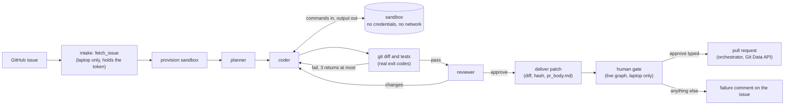
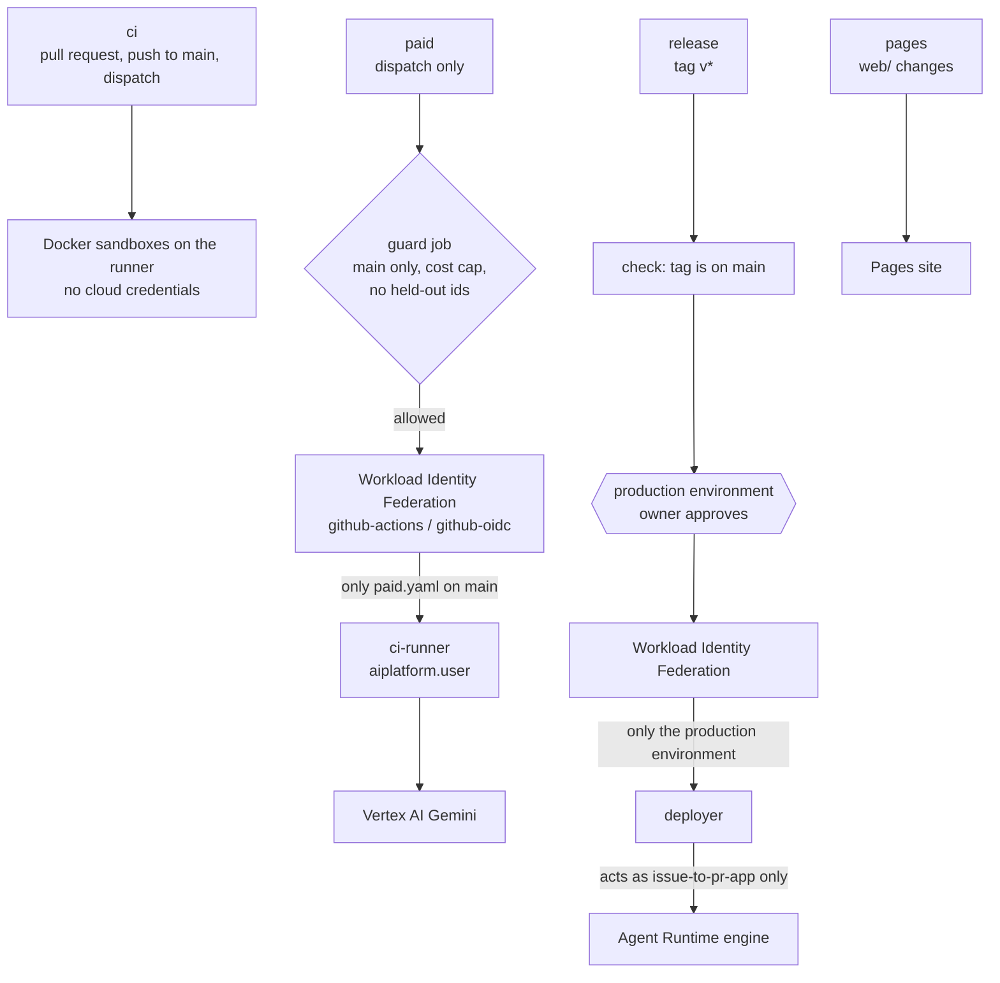
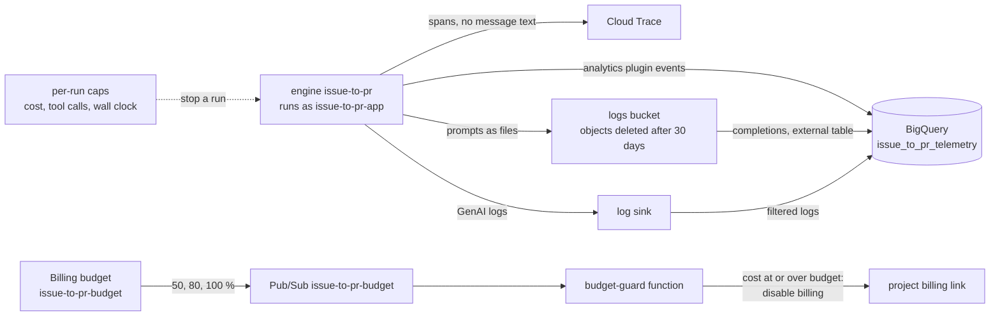
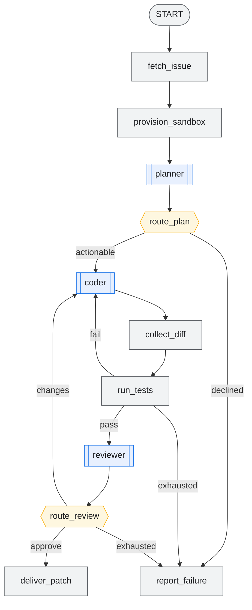
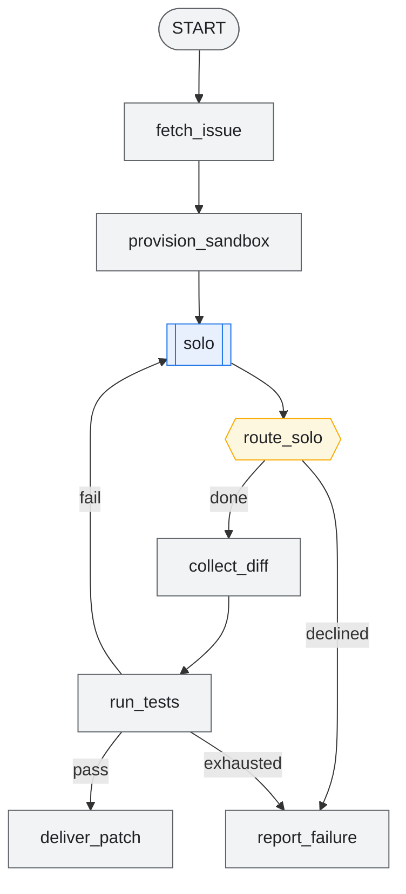

# Architecture

issue-to-pr turns a GitHub issue into a tested pull request. A graph of three LLM agents and deterministic function nodes does the work in a hermetic sandbox, on a laptop or on Google Cloud Agent Runtime. This page shows the whole system once as a picture and then in four focused views.

The picture is generated by [`architecture/overview.py`](architecture/overview.py) (`make diagrams`, needs Graphviz). It draws only what exists in `deployment/terraform`, `.github/workflows` and the code. A test fails when the committed SVG was rendered from a different version of the script. The icon set has no Cloud Trace, Billing budget or project-billing icon, so those nodes use the nearest ones (the billing node is labelled "billing, not identity"); the labels carry the names. The repository is the GitHub box itself: it holds the four workflows, and `pages` builds the site from it. The laptop calls Gemini with the owner's credentials and, with `ENVIRONMENT_BACKEND=agent_runtime`, reaches cloud sandboxes through a `sandbox-caller` token signed by the owner.

## 1. One run's journey

A live run starts on the laptop, which holds the GitHub token; the deployed agent runs the bench graph only and has no token. The sandbox has no credentials and no network; only commands, files and output cross its boundary. Routing uses the real `git diff` and the real test exit codes, never what a model says.

Where steps run: on the laptop, every step. On Agent Runtime, the bench graph (task loading, planner, coder, tests, reviewer, `deliver_patch`), with the sandbox as an Agent Runtime sandbox reached through the `sandbox-caller` token. The live intake, the human gate and the pull request exist only in the live graph, which runs on the laptop.

## 2. CI/CD and identity

Four workflows. No key files: GitHub proves who it is with an OIDC token, and Workload Identity Federation (pool `github-actions`, provider `github-oidc`) trusts one repository.

`ci-runner` and `deployer` each hold two project roles (`aiplatform.user`, `serviceusage.serviceUsageConsumer`). `deployer` may also act as `issue-to-pr-app`, and as no other account.

## 3. Observability and cost

Spans go to Cloud Trace with references to the messages, not the text. The prompts and replies are files in the logs bucket, which BigQuery reads as an external table. The analytics plugin and the log sink write into the `issue_to_pr_telemetry` dataset. Every run has a cost cap and a tool-call cap in the budget plugin; the project has a budget with a hard stop.

## 4. The agent graph

Generated from `web/src/graph/graphs.json`, the file the replay site draws, by [`architecture/agent_graph.py`](architecture/agent_graph.py). A test fails when this block differs from what the script writes. The single-agent baseline drops only the planner and the reviewer.

<!-- agent-graph:start -->

**The multi-agent graph** (from `app.pipeline.build_workflow`):

**The single-agent baseline** (from `app.baseline.build_baseline_workflow`):

<!-- agent-graph:end -->
